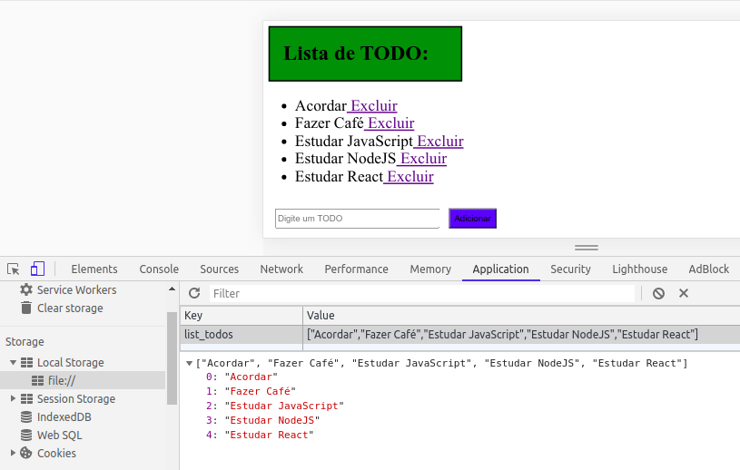

# ListaTodo
Criação de uma lista de afazeres SIMPLES com Javascript:

* Usuário pode adicionar ítens;
* Usuário pode excluir ítens;

## Conhecimentos:
* HTML, CSS, Javascript;
* Query selector;
* Criação de elementos;
* Manipulação "string JSON" e objeto javascript:
    - JSON.stringify();
    - JSON.parse();
* Armazenandos de dados na storage API;